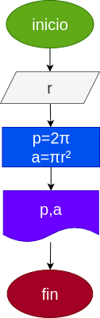

# Programa #1
Programa para calcular el area y el perimetro de un circulo de radio r

# Analisis

## Input
### Variables de entrada
r: radio del circulo
### Processing
p: perimetro del circulo p= 2π 

a: area del circulo a= πr² 
### Output
a,p
# Diseño

# Construcción
